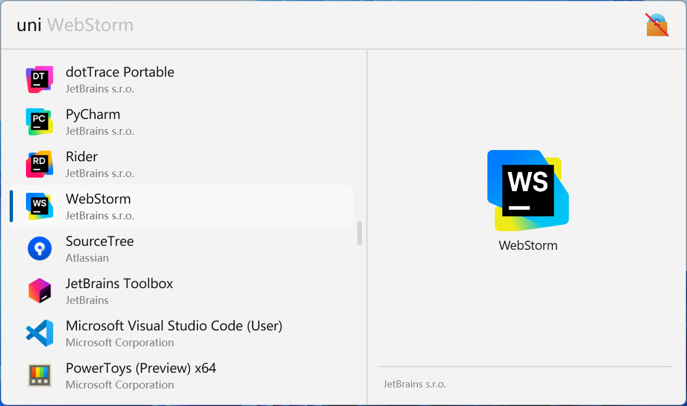
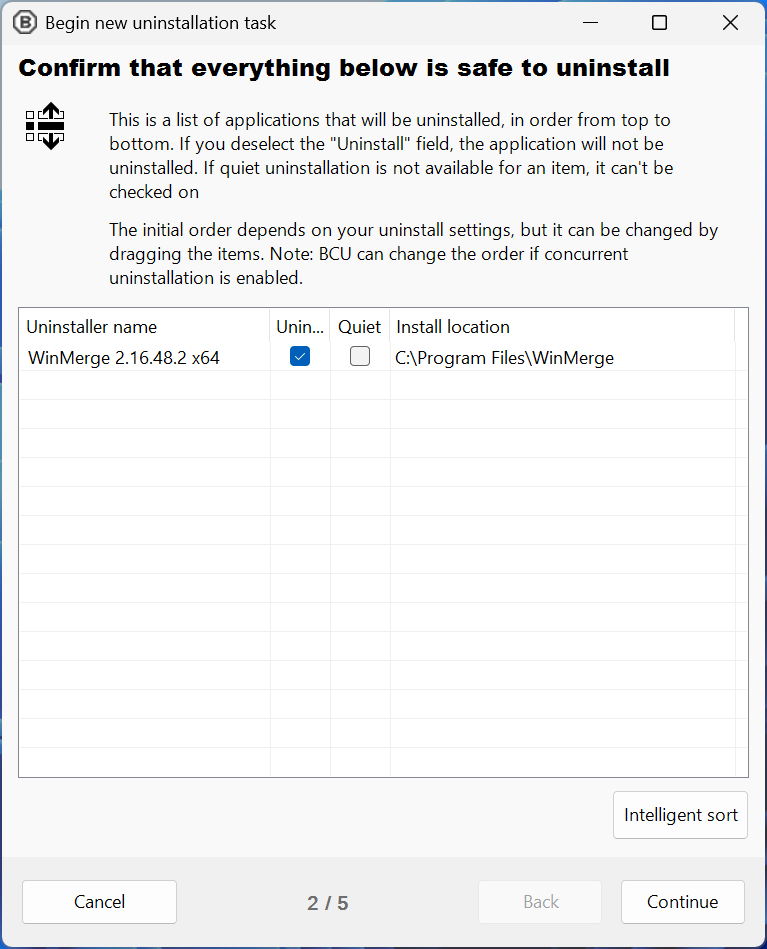

  

# Flow Launcher UninstallerPlus Plugin

**This plugin is a program uninstaller for [Flow Launcher](https://github.com/Flow-Launcher/Flow.Launcher). It can help you uninstall desktop and Microsoft store programs based on [Bulk-Crap-Uninstaller](https://github.com/Klocman/Bulk-Crap-Uninstaller).**

## ⭐ Features

- Uninstall desktop programs
- Uninstall Microsoft store programs
- Uninstall Steam programs
- Uninstall system components
- Uninstall Windows features and updates
- Quietly uninstall programs
- Modify programs
- Manually uninstall programs
- Create restore point after uninstallation
- Clean up program leftovers after uninstallation

## 🖼️ Screenshots

<picture>
  <source media="(prefers-color-scheme: dark)" srcset="./images/screenshot1_dark.png">
  <source media="(prefers-color-scheme: light)" srcset="./images/screenshot1_light.png">
  
</picture>

<picture>
  <source media="(prefers-color-scheme: dark)" srcset="./images/screenshot2_dark.png">
  <source media="(prefers-color-scheme: light)" srcset="./images/screenshot2_light.png">
  
</picture>

## 🚀 Installation

* Plugin Store (Recommended)

  1. Search `Uninstaller+` in Flow Launcher Plugin Store and install

* Manually Release

  1. Downlaod zip file from [Release](https://github.com/Jack251970/Flow.Launcher.Plugin.UninstallerPlus/releases)
  2. Unzip the release zip file
  3. Place the released contents in your `%appdata%/FlowLauncher/Plugins` folder and **restart** Flow Launcher

* Manually Build

  1. Clone the repository
  2. Run `build.ps1` or `build.sh` to publish the plugin in `.dist` folder
  3. Unzip the release zip file
  4. Place the released contents in your `%appdata%/FlowLauncher/Plugins` folder and **restart** Flow Launcher

## 📝 Usage

### 0. Set Action Keyword

The default action keyword is `uni`, you can change it in the Flow Launcher.

### 1. Config Administrator Mode (Optional)

This plugin requires administrator privileges to:

* Load Microsoft Store programs
* Create system restore points
* Clean all program leftovers

For full functionality, we recommend running Flow Launcher as administrator during automatic launches:

* Exit Flow Launcher
* Run Flow Launcher as administrator
* Open setting window and navigate to `General` page
* Enable `Use logon task instead of task entry for faster startup experience`
* Disable `Start Flow Launcher on system startup`
* Enable `Start Flow Launcher on system startup`

Then we can verify if it succeeded:

* Open `Task Scheduler`
* Find the logon task with name `Flow.Launcher Startup`
* Check if `Security options` -> `Run with highest privileges` is on

> [!WARNING]
> Running as administrator may launch other applications with elevated privileges without UAC prompts.
> So please use this with caution.

### 2. Uninstall Programs

Search for programs in Flow Launcher and click any result to open the uninstallation window.

Follow the prompts to uninstall programs, create restore points and perform additional cleanup.

### 3. Advance Options

Right click programs to open context menu to:

* Uninstall programs
* Quietly uninstall programs
* Modify programs
* Manually uninstall programs

## 📚 Reference

- [ICONS](https://icons8.com/icons)
- [ClipboardPlus](https://github.com/Jack251970/Flow.Launcher.Plugin.ClipboardPlus)
- [Bulk-Crap-Uninstaller](https://github.com/Klocman/Bulk-Crap-Uninstaller)

## 📄 License

[Apache License V2.0](LICENSE)
