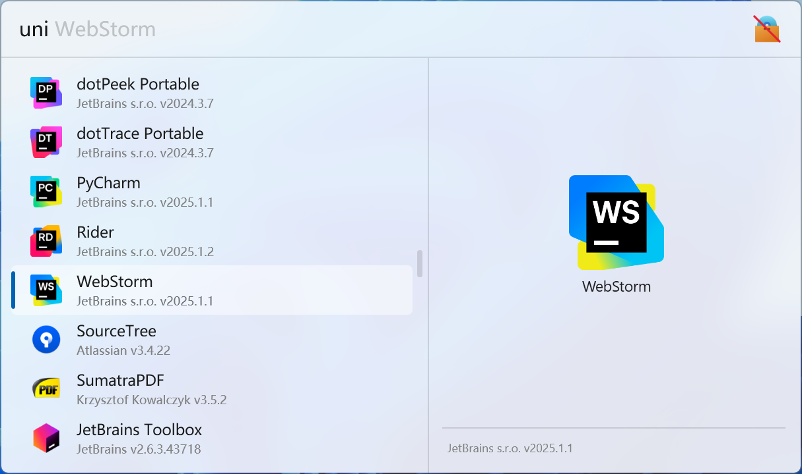
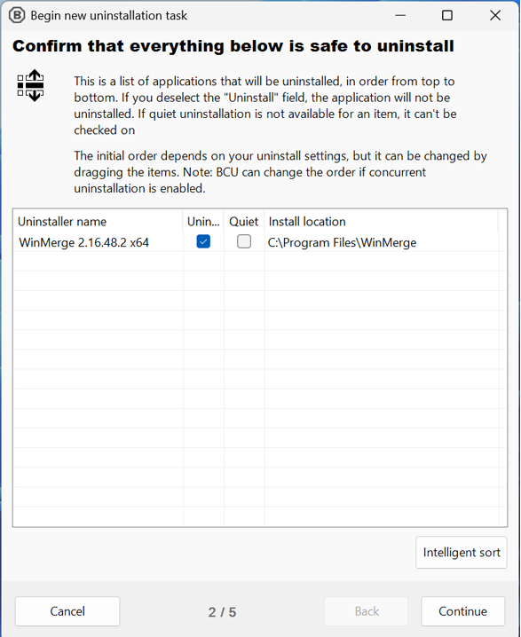

  

# Flow Launcher UninstallerPlus Plugin

**This plugin is a program uninstaller for [Flow Launcher](https://github.com/Flow-Launcher/Flow.Launcher). It can help you uninstall desktop and Microsoft store programs based on [Bulk-Crap-Uninstaller](https://github.com/Klocman/Bulk-Crap-Uninstaller).**

## ⭐ Features

- Uninstall desktop programs
- Uninstall Microsoft store programs
- Uninstall system components
- Uninstall Windows features and updates
- Quietly uninstall programs
- Create restore point after uninstallation
- Clean program leftovers after uninstallation

## 🖼️ Screenshots

<picture>
  <source media="(prefers-color-scheme: dark)" srcset="./images/screenshot1_dark.png">
  <source media="(prefers-color-scheme: light)" srcset="./images/screenshot1_light.png">
  
</picture>

<picture>
  <source media="(prefers-color-scheme: dark)" srcset="./images/screenshot2_dark.png">
  <source media="(prefers-color-scheme: light)" srcset="./images/screenshot2_light.png">
  
</picture>

## 🚀 Installation

* Plugin Store (Recommended)

  1. Search `Uninstaller+` in Flow Launcher Plugin Store and install

* Manually Release

  1. Downlaod zip file from [Release](https://github.com/Jack251970/Flow.Launcher.Plugin.UninstallerPlus/releases)
  2. Unzip the release zip file
  3. Place the released contents in your `%appdata%/FlowLauncher/Plugins` folder and **restart** Flow Launcher

* Manually Build

  1. Clone the repository
  2. Run `build.ps1` or `build.sh` to publish the plugin in `.dist` folder
  3. Unzip the release zip file
  4. Place the released contents in your `%appdata%/FlowLauncher/Plugins` folder and **restart** Flow Launcher

## 📝 Usage

### 0. Set Action Keyword

The default action keyword is `uni`, you can change it in the Flow Launcher.

### 1. Launcher Flow Launcher under Administrator Mode (Optional)

* Exit Flow Launcher
* Run Flow Launcher as administrator
* Enable `Use logon task instead of task entry for faster startup experience` in general setting page
* Disable `Start Flow Launcher on system startup` in general setting page
* Enable `Start Flow Launcher on system startup` in general setting page

### 2. Uninstall Programs

Search programs and click the them directly to open uninstallation window.
Then follow its instructions to uninstall programs, clean program leftovers and do more things.

## 📚 Reference

- [ICONS](https://icons8.com/icons)
- [Bulk-Crap-Uninstaller](https://github.com/Klocman/Bulk-Crap-Uninstaller)
- [ClipboardPlus](https://github.com/Jack251970/Flow.Launcher.Plugin.ClipboardPlus)

## 📄 License

[Apache License V2.0](LICENSE)
